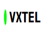
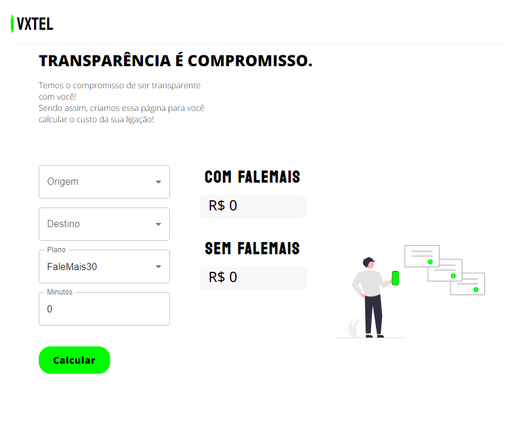

<h1 align="center">
    
</h1>

<h1 align="center">
    
</h1>

# Indice
- [Sobre](#-sobre)
- [Tecnologias Utilizadas](#-tecnologias-utilizadas)
- [Instalação do projeto](#-instalacao-do-projeto)

## Sobre

O projeto **web-vxTel** é uma aplicação web (front end) com intuito de calcular o custo total da ligação, seguindo uma tabela de preço enviada por email.
É o front end do teste para a vaga de Full Stack da empresa **Vortx**.

---

### 🚀 Tecnologias utilizadas

O projeto utilizou as seguintes principais tecnologias:

- [ReactJS](https://reactjs.org)
- [Axios](https://github.com/axios/axios)
- [Typescript](https://www.typescriptlang.org)
- [Vite](https://vitejs.dev)

O projeto consome uma API própria

- [api-vxTel](https://github.com/isabellasantiago/api-VxTel.git)

## 🗂 Instalação do projeto

Recomendado instalar o projeto todo pela **workspace (vxTel)**, seguindo README.md da mesma.
- [vxTel](https://github.com/isabellasantiago/vxTel.git)

Mas, caso queira instalar apenas o front end:

```bash
    # Clonar o repositório
    $ git clone https://github.com/isabellasantiago/web-vxTel.git
    # Entrar no diretório
    $ cd web-vxTel
    # Instalar as dependências
    $ yarn
    # Iniciar o projeto
    $ yarn dev
```
O projeto roda na porta 5173, porta padrão do Vite.
---

Desenvolvido 💜 por Isabella Santiago